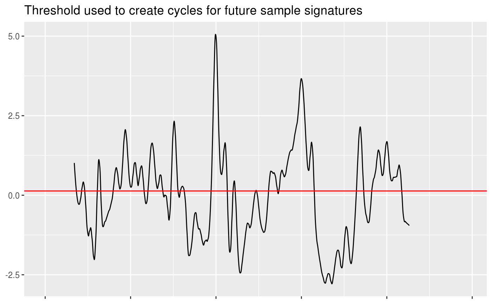

<!-- README.md is generated from README.Rmd. Please edit that file -->

# bulletsamplr

[](https://choosealicense.com/)
[](https://cran.r-project.org/package=bulletsamplr)
[](https://www.tidyverse.org/lifecycle/#experimental)
[](/commits/master)
[](https://travis-ci.org/srvanderplas/bulletsamplr)
[](https://codecov.io/github/srvanderplas/bulletsamplr?branch=master)

The goal of bulletsamplr is to create bullet signatures which can be
used to examine the behavior of match statistics under truly random
conditions.

## Installation

You can install the released version of bulletsamplr from
[github](https://github.com/srvanderplas/bulletsamplr) with:

``` r
devtools::install_github("srvanderplas/bulletsamplr")
```

## Example

``` r
library(ggplot2)
library(bulletsamplr)
library(bulletxtrctr)
library(dplyr)
library(purrr)
library(stringr)
```

### Creating cycles for resampling

We start with a signature from a scanned bullet land:

``` r
data(sig)

ggplot(aes(x = x, y = sig), data = sig) + 
  geom_line() + 
  ggtitle("Original Signature") + 
  theme(axis.title = element_blank(), axis.text.x = element_blank())
```


The threshold bootstrap creates new sequences by resampling “cycles”
from actual data. These cycles are created as follows:

First, the median of the signature is used to divide the signature into
**cycles** of one positive and one negative region of the signature
(relative to the median value).

``` r
threshold <- median(sig$sig, na.rm = T)
ggplot(aes(x = x, y = sig), data = sig) + 
  geom_line() + 
  geom_hline(aes(yintercept = threshold), color = "red") + 
  ggtitle("Threshold used to create cycles for future sample signatures") + 
  theme(axis.title = element_blank(), axis.text.x = element_blank())
#> Warning: Removed 265 rows containing missing values (geom_path).
```



These divisions are shown below, with each segment in a different color;
adjacent segments are disjoint.

``` r
sig_slices <- crosscut_slice(sig) %>% bind_rows() %>%
  group_by(.chunk) %>%
  # mutate(x = x - mean(x, na.rm = T)) %>%
  ungroup()

sig_slices %>%
  group_by(.chunk) %>%
  mutate(x = ifelse(.chunk == max(sig_slices$.chunk), rev(x), x)) %>%
  mutate(sig = ifelse(.chunk == max(sig_slices$.chunk), -sig, sig)) %>%
  ungroup() %>%
  arrange(.chunk, x) %>%
  mutate(xnew = 1:nrow(.)) %>%
ggplot(data = ., aes(x = xnew*1.5625, y = sig, color = factor(.chunk))) + geom_line() + 
  scale_color_discrete("Chunk") + 
  ggtitle("Cycles (and boundary regions)") + 
  theme(axis.title = element_blank(), axis.text.x = element_blank())
#> Warning: Removed 265 rows containing missing values (geom_path).
```


The cycles are then post-processed so that they all share the same
orientation (positive portion of the cycle first); this requires that
the boundary chunks be oriented so that the final portion of the chunk
is negative. End chunks are thus reversed (in x) and may be flipped in y
depending on the original orientation.

``` r

sig_slices$chunk_label <- factor(
  sig_slices$.chunk, 
  labels = c("boundary_start", 
             paste("cycle", unique(sig_slices$.chunk)[-c(1, max(sig_slices$.chunk))]), 
             "boundary_end"))

ggplot(aes(x = x, y = sig, group = .chunk), data = sig_slices) + 
  facet_wrap(~chunk_label, scales = "free") +
  geom_line() + theme(axis.title = element_blank()) + 
  ggtitle("Sliced Land Signature")
#> Warning: Removed 265 rows containing missing values (geom_path).
```


The cycles can then be saved to a database, or the data frame of cycles
can be reassembled directly into new sequences. Ideally, of course, new
sequences would be assembled from a library composed of cycles from many
different signatures.

### Resampling cycles to create new sequences

This portion of the tutorial will use cycles derived from Barrel 1,
Bullets 1 and 2 of the Hamby 252 series, downloaded from NIST (the
`x3ptools` package includes these bullets). The [`bulletxtrctr`
demo](https://heike.github.io/bulletxtrctr/index.html) has code for
obtaining and processing these files to obtain the signatures used to
create the `signature_slices` object.

``` r
# Load sample signature slices
data(signature_slices)

# 171 different sequences
length(unique(signature_slices$id)) 
#> [1] 171

# Sequence types
signature_slices %>% select(id, type) %>%
  unique() %>%
  group_by(type) %>%
  count()
#> # A tibble: 2 x 2
#> # Groups:   type [2]
#>   type         n
#>   <chr>    <int>
#> 1 boundary    24
#> 2 pn         147
```

The 12 lands used to create signature\_slices produced 171 sequences, of
which 24 are boundary sequences and do not contain complete cycles, and
147 are complete cycles, oriented so that the positive portion of the
cycle comes first.

First, we choose a target signature length. The two bullets used to
derive these sequences have an average signature length of 1511.333, so
a target signature length of 1500 will produce sequences approximately
the same as the original signatures.

In the call to crosscut\_assemble, we specify the output resolution to
be 1.5625 microns, which is the resolution of the original scans.

``` r
set.seed(309240538)
seq1 <- crosscut_assemble(1500, signature_slices, output_res = 1.5625)

ggplot(seq1, aes(x = x, y = sig)) + geom_line()
#> Warning: Removed 148 rows containing missing values (geom_path).
```


We can use the assembled sequence to assess the distribution of features
created by `bulletxtrctr` under the null distribution:

``` r
set.seed(20401889)
n <- 20
# Assemble n sequences from signature_slices
seqs <- purrr::map_df(1:n, 
  ~crosscut_assemble(len = 1500, df = signature_slices, output_res = 1.5625), 
  .id = 'rep') %>%
  mutate(rep = str_pad(rep, 2, "left", "0"))

ggplot(seqs, aes(x = x, y = sig, group = rep)) + geom_line() + 
  facet_wrap(~rep)
#> Warning: Removed 2368 rows containing missing values (geom_path).
```


``` r
chunks_per_seq <- seqs %>% group_by(rep) %>%
  select(rep, id, .idx) %>%
  unique() %>%
  summarize(chunks = n())

seq_replications <- seqs %>% group_by(id) %>% 
  select(rep, id, .idx) %>%
  unique() %>% summarize(chunks = n())
```

Each sequence had between 11 and 21 chunks composed of a cycle or a
partial cycle (in the case of a boundary region). With 171 chunks
available, we would expect that each chunk was re-used around 10.0588235
times (note that the library of cycles is kept small for demonstration
purposes; in real life, we would want a much larger library). In fact,
each chunk was used between 1 and 5 times.

``` r
# Nest generated sequences
nested_seqs <- seqs %>%
  tidyr::nest(-rep, .key = sig)

# Set up comparison matrix
alignments <- tidyr::crossing(data_frame(seq1 = unique(seqs$rep)),
                              data_frame(seq2 = unique(seqs$rep))) %>%
  filter(seq1 != seq2) %>%
  left_join(nested_seqs, by = c("seq1" = "rep")) %>%
  rename(sig1 = sig) %>%
  left_join(nested_seqs, by = c("seq2" = "rep")) %>%
  rename(sig2 = sig)

# Function to compute rows of overlap
overlap_by_chance <- function(df1, df2) {
  mean(df1$id[!is.na(df1$sig)] %in% df2$id[!is.na(df2$sig)])
}
  
alignments <- alignments %>%
  mutate(
    overlap = purrr::map2_dbl(.x = sig1, .y = sig2, overlap_by_chance),
    aligned = purrr::map2(.x = sig1, .y = sig2, ~sig_align(.x$sig, .y$sig)),
    striae = purrr::map(aligned, sig_cms_max, span = 75)
  ) %>% 
  mutate(
    features = purrr::map2(.x = aligned, .y = striae, .f = extract_features_all, resolution = 1.5625)
  )
```

With a cycle library of 171 chunks, we can expect that significant
overlap between resampled sequences might occur. Thus, the conclusions
drawn about the null distribution of features in this README should not
be extrapolated; much different (and better) results should be expected
when using a feature library of sufficient
size.

``` r
ggplot(alignments, aes(x = seq1, y = seq2, fill = overlap)) + geom_tile() +
  scale_fill_gradient("Proportion\noverlap b/w\nSequence 1,\nSequence2", low = "white", high = "red", limits = c(0, 1)) + 
  coord_fixed() + 
  xlab("Resampled Sequence 1") + ylab("Resampled Sequence 2")
```


``` r
features <- alignments %>% 
  select(seq1, seq2, features) %>%
  tidyr::unnest() %>%
  tidyr::gather(key = "var", value = "value", -seq1, -seq2)
features %>%
  filter(!str_detect(var, "_mm")) %>%
ggplot(aes(x = value)) + 
  geom_density() + 
  facet_wrap(~var, scales = "free") + 
  ggtitle("Distribution of Features for Resampled Sequences")
```


